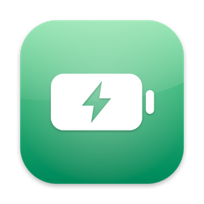

<p align="center">
  
</p>

<h1 align="center">Battery Monitor</h1>

<p align="center">
  <a href="https://github.com/lacdonlang/batterymonitor/releases/latest"></a>
  
  
  <a href="LICENSE"></a>
</p>

<p align="center">
  <a href="README.md">English</a> | <b>简体中文</b>
</p>

<p align="center">
  一个 macOS 菜单栏应用:监控 Mac 内置电池与所有蓝牙外设的电量,在设备没电前提醒你。
</p>

## 功能

- **全设备电量一览** — 内置电池、AirPods(含充电盒)、Magic Keyboard / Mouse / Trackpad、罗技 MX 系列等,凡是 macOS 可见的设备都在列表里。
- **充电状态与系统一致** — 读取系统电池小组件同源的电源数据,充电中的设备显示绿色和闪电标记。
- **低电量通知** — 阈值、重复提醒冷却、恢复缓冲均可配置,通知支持"稍后提醒 / 忽略此设备"操作。
- **桌面小组件** — 小 / 中 / 大三种尺寸,毛玻璃样式,每行同时是一条电量进度条。
- **中英双语** — 默认跟随系统语言,可在设置中手动切换。
- **开机自启**、按设备静音、轮询间隔可调。

## 安装

从 [Releases](https://github.com/lacdonlang/batterymonitor/releases/latest) 下载最新的 `BatteryMonitor-x.y.z.dmg`,打开后把 **BatteryMonitor** 拖进「应用程序」文件夹。

DMG 已使用 Developer ID 签名并通过 Apple 公证,首次打开确认一次即可,不会有 Gatekeeper 拦截。

> [!NOTE]
> 添加小组件:先运行一次 App,然后在桌面右键 → 编辑小组件 → 搜索 "Battery Monitor"。

## 自行构建

依赖:macOS 14+、Xcode(含命令行工具)、[XcodeGen](https://github.com/yonaskolb/XcodeGen)。

```sh
git clone https://github.com/lacdonlang/batterymonitor.git
cd batterymonitor

# 生成 Xcode 工程(project.yml 是唯一事实来源)
xcodegen generate --spec project.yml

# 运行测试(独立测试 harness,无需 XCTest)
swift run BatteryMonitorTestHarness

# 完整本地验证:构建、测试、plist/entitlements/资源校验、Xcode 构建冒烟
./scripts/test.sh
```

命令行查看当前设备电量:

```sh
swift run BatteryMonitorCLI            # 表格输出
swift run BatteryMonitorCLI --json     # JSON 输出
```

构建公证版 DMG(需要 Apple 开发者账号,凭据配置见脚本头部注释):

```sh
./scripts/release_dmg.sh
```

> [!IMPORTANT]
> App Group 标识使用 Team ID 前缀(`<TeamID>.com.lacdon.batterymonitor`)。fork 后用自己的账号签名时,请替换 `project.yml` 与 `Sources/BatteryMonitorShared/BatteryMonitorConstants.swift` 中的 Team ID——macOS 上 `group.` 前缀的 App Group 会被 containermanagerd 拒绝,容器内所有文件访问将永久阻塞。

## 工作原理

电量数据由一条按优先级排列的 reader 链合并产生:排在前面的 reader 在去重时决定设备身份,后面的只补齐缺失的充电/连接状态。

| Reader | 数据来源 | 覆盖 |
|---|---|---|
| IOKitPowerSource | IOPS 电源快照 | 内置电池、部分外设 |
| AppleSmartBattery | IORegistry | 内置电池细节 |
| IORegistry HID | `BatteryPercent` 字段 | Magic 系列外设 |
| IOBluetooth | 经典蓝牙电池字段 | 耳机等 |
| SystemProfiler | `SPBluetoothDataType` | AirPods 左右耳/充电盒 |
| CoreBluetooth BLE | 标准电池服务 (0x180F) | MX Master 等 BLE 设备 |
| AccessoryPowerSource | 系统电池小组件同源接口 | 权威充电状态 |

菜单栏 App 每 3 分钟轮询一次并响应电源变化事件,把快照写入 App Group 容器;WidgetKit 小组件从同一容器读取渲染。已断开的设备保留 7 天用于通知状态延续,但不在界面显示。

## 许可证

[MIT](LICENSE) © 2026 lacdonlang
